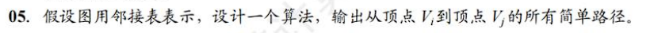
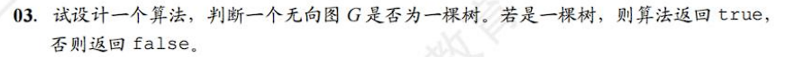

# 线性表

## 线性表的顺序表示


```c
int hash[0xFFFF];
void findRepeated(int A[], int B[], int C[], int n){
    for(int i = 0; i < n; i++){
        hash[A[i]]++;
        hash[B[i]]++;
        hash[C[i]]++;
    }
    for(int i = 0; i < n; i++){
        if(hash[A[i] > 1])
            print(A[i]);
    }
    for(int i = 0; i < n; i++){
        if(hash[B[i] > 1])
            print(B[i]);
    }
    for(int i = 0; i < n; i++){
        if(hash[C[i] > 1])
            print(C[i]);
    }
}
```

```c
void findRepeated(int A[], int B[], int C[], int n){
    int i = 0, j = 0, k = 0;
    while(i < n && j < n && k < n){
        if(A[i] == B[j] && B[j] == C[k]){
            print(A[i]);
            i++; j++; k++;
        }
        else{
            i++;
        }
    }
}
```


```c
void findMajor(int arr[], int n){
    int *hash = (int*)malloc(sizeof(int)*(n-1));
    for(int i = 0; i < n; i ++){
        hash[arr[i]] ++;
        if(hash[arr[i]] > n/2){
            print(arr[i]);
            return;
        }
    }
    print(-1);
    return;
}
```

O(n)   O(n)

```c

```

最优法：O(n)  O(1)

# 

MissMin的值一定在1到1+n之间

```c
int hash[0xFFFF];
void findMissMin(int arr[], int n){
    int max = 0;
    for(int i = 0; i < n; i++){
        if(arr[i] > max)
            max = arr[i];
        if(arr[i] >= 0)
            hash[arr[i]]++;
    }
    for(int i = 1; i <= max; i++){
        if(hash[i] == 0){
            print(i);
            return;
        }
    }
}
```

O(n)  O(1)

## 线性表的链式表示


```c
void del(Node* head, int x){
    Node* ptr = head->next;
    Node* pre = head;
    Node* q;
    while(ptr!=NULL){
        if(ptr->data == x){
            q = ptr;
            pre->next = q->next;
            ptr = q->next;
            free(q);
        }
        else{
            ptr = ptr->next;
            pre = pre->next;
        }
    }
}
```


```c
void delMin(Node* head){
    Node* ptr = head->next;
    Node* pre = head;
    Node* minPtr = head->next;
    Node* minPre;
    while(ptr!=NULL){
        if(ptr->data < minPtr->data){
            minPtr = ptr;
            minPre = pre;
        }
        ptr = ptr->next;
        pre = pre->next;
    }
    minPre->next = minPtr->next;
    free(minPtr);
}
```


```c
// 头插法
void reverse(Node* head){
    Node* ptr = head->next;
    Node* temp;
    Node* tail = head;
    while(ptr!=NULL){
        temp = ptr;
        head->next = temp;
        if(tail == head){
            temp->next = NULL;
            tail = temp;
        }
        else{
            temp->next = tail;
            tail = temp;
        }
    }
}
```


```c

```


```c
void disJoin(Node* head){
    Node* head1 = head; Node* head2 = head->next;
    Node* tail1 = head; Node* tail2 = head->next;
    Node* ptr = head2->next;
    int flag = 1;
    while(ptr!=NULL){
        if(flag == 1){
            tail1->next = ptr;
            tail1 = ptr;
        }
        if(flag == -1){
            tail2->next = ptr;
            tail2 = ptr;
        }
        flag *= -1;
        ptr = ptr->next;
    }
    tail1->next = NULL;
    tail2->next = NULL;
}
```

## 技巧

### 重复值


# 栈


1) AD  确保最终栈是空的

```c
int judge(char opr[]){
    int i, j = 0;
    while(opr[i]!='\0'){
      	if(opr[i] == 'I')
            j++;
        else{
            j--;
            if(j<0){
                printf("X_X...");
                return 0;
            }
        }
    }
    if(j!=0){
        printf("x_X...");
        return 0;
    }
    return 1;
}
```


```c
int isMiddleConjunct(Node* L, int n){
    int indx = 1;
    Node* ptr = L;
    char s[n/2];
    if(n%2 == 1){
        // xxyxx
        while(indx <= n/2){
            ptr = ptr->next;
        }
        
    }
}
```


```c
#define maxsize 100

typedef struct{
    int stack[maxsize];
    int top[2];
}Stack;
```

```c
int push(Stack* s, int i, int x){
    if(s->top[1] - s->top[0] <= 1){
        printf("full\n");
        return 0;
    }
    if(i == 0){
        s->top[i]++;
        s->stack[s->top[i]] = x;
        // s->stack[++s->top[i]] = x;
    }
    if(i == 1){
        ...
    }
}
```

```c
int pop(Stack* s, int i);
```


# 队列


顺序

```c
#define maxSize 0xFFFF
void push(Queue* q, int x){
    Node* new = (Node*)malloc(sizeof(Node));
    new->data = x;
    new->next = NULL;
    q->rear->next = new;
    
}
```


```c
void reverse(Queue* q){
    s->stack[s->top] = 
}
```

# 

# 串

## kmp


```c
void getNext(char* mode, int n, int next[]){
    // mode第一个字符为空
    int i = 1, j = 0;
    while(i < n-1){
        if(j == 0 || mode[i] == mode[j]){
            i++; j++;
            next[i] = j;
        }
        else
            j = next[j];
    }
}
```

```c
void kmp(char* str, char* mode, int strlen, int modelen){
    int next[modelen];
    getNext(mode, modelen, next);
    int j = 1;
    for(int i = 0; i < strlen; i++){
        if(str[i] == mode[j]){
            j++;
        }
        else{
            j = next[j];
        }
        if(j == modelen){
            // finish
        }
    }
}
```

# 树

## 二叉树


```c
void postOrder(BinNode* root){
    InitStack(s);
    BinNode* p = root;
    BinNode* r = NULL;
    while(p || !isEmpty(s)){
     	if(p){
            push(s, p);
            p = p->left;
        }
        else{
            GetTop(s, p);
            if(p->right && p->right != r)
                p = p->right;
            else{
                pop(s, p);
                visit(p->data);
                r = p;
                p = NULL;
            }
        }//else
    }//while
}
```


编写先序遍历二叉树的非递归算法。

```c
void preOrder(BinNode* root){
    InitStack(s);
    BinNode* p = root;
    BinNode* r = NULL;
    while(p || !isEmpty(s)){
        if(p){
            visit(p);
            push(s, p);
            p = p->left;
        }
        else{
            GetTop(s, p);
            if(p->right && p->right!=r){
                p = p->right;
            }
            else{
                pop(s, p);
                r = p;
          		p = NULL;
            }
        }
    }
}
```

# 图

## 广度优先遍历图

邻接矩阵

```c
int hash[0xFFF] = {0};
void BFS(int** vex, int i, int n){
    Queue* q = (Queue*)malloc(sizeof(Queue));
    push(q, i);
    hash[i] = 1;
    int p;
    do{
        p = pop(q);
        for(int i = 0; i < n; i++){
            if(hash[i] == 0 && vex[p][i]){
                hash[i = 1;
                push(q, i);
            }
        }
    }while(!isEmpty(q));
}
```

邻接表

```c
typedef struct{
    Node* firstarc;
}Vertix;

typedef struct{
    int indx;
    Node* next;
}Node;

typedef struct{
    int size;
    Vertix vertix[];
}Graph;
```

```c
int hash[0xFFF] = {0};
void BFS(Graph* g, int i){
    Queue* q = malloc(sizeof(Queue));
    push(q, i);
    hash[i] = 1;
    int p;					// p作为下一个要遍历的结点索引号
    do{
        p = pop(q);
        for(arc* ptr = g->vertix[p]->firstarc; ptr; ptr = ptr->next){
            if(!hash[ptr->indx]){
                hash[ptr->indx] = 1;
                push(q, ptr->indx);
            }
        }
    }while(!isEmpty(q));
}
```

## 深度优先遍历图



```c
int hash[0xFFF];
void DFS(Graph* g, int a, Node* pre, int i, int j){
    if(a == j){			// 到达终点
        Stack *s = malloc(sizeof(Stack));
        push(s, j);
        while(pre){
            push(s, pre->indx);
        }
        while(!isEmpty(s))
            printf("%d ", pop(s));
        free(s);
        return;
    }
    for(Vertex* ptr = g->vertex[a]->first; ptr; ptr = ptr->next){
        if(!hash[ptr->indx]){
            hash[ptr->indx] = 1;
            Node* thisNode = malloc(sizeof(Node));
            thisNode->indx = ptr->indx;
            thisNode->pre = pre;
            DFS(g, ptr->indx, thisNode, i, j);
            hash[ptr->indx] = 0;
        }
    }
}
```


## 生成树

### Prim


```c
int** Prim(int** edge, int size){
    int** ans = malloc(sizeof(int)*size*size)
    Set* u = malloc(sizeof(Set));
    Set* remain = malloc(sizeof(Set));
    for(int i = 0; i < size; i++)
        insert(remain, i);
    int mini = 0， minj = 0;
    for(int i = 0; i < size; i++){
        for(int j= i; j < size; j++){
            if(edge[i][j] < edge[mini][minj]){
                mini = i; minj = j;
            }
        }
    }
    insert(u, mini); insert(u, minj); remove(remain, mini); remove(remain, minj);
    ans[mini][minj] = 1;
    ans[minj][mini] = 1;
    while(!isEmpty(remain)){
        for(i in remain){
            for(j in u){
                // find the smallest
            }
        }
        insert(u, mini); remove(remain, mini); 
        ans[mini][minj] = 1;
        ans[minj][mini] = 1;
    }
    return ans;
}
```

### Kruskal


```c
#define blue 2
#define red  1
int color[0xFFF];
bool DFS(int** edge, int i, int size){
    if(!color[i])
        color[i] = red;
    for(int a = 0; a < size; a++){
        if(edge[i][a] && color[a]){
            if(color[a] == color[i])
                return 0;
        }
        else if(edge[i][a] && !color[a]){
            if(color[i] == red)
                color[a] = blue;
            else
                color[a] = red;
            return DFS(edge, a, size);
        }
    }
    return 1;
}
```




```c
// 有n-1条边的连通无向图是树
bool isTree(int** edge, int size){
    // 无向图数边
    int edges = 0;
    for(int i = 0; i < size; i++){
        for(int j = i; j < size; j++){
            if(edge[i][j])
                edges++;
        }
    }
    if(edges != size - 1)
        return 0;
    int isVisited[size];
    DFS(edge, 0, size);
    for(int i = 0; i < size; i++){
        if(!isVisited[i])
            return 0;
    }
    return 1;
}
```


```c
int degree[0xFFF];
void tup(int** edge, int size){
    for(int i = 0; i < size; i++){
        for(int j = 0; j < size; j++){
            if(edge[i][j])
                degree[i]++;
        }
    }
    Stack* s = malloc(sizeof(Stack));
    for(int i = 0; i < size; i++){
        if(degree[i] == 0)
            push(s, i);
    }
    int top;
    while(!isEmpty(s)){
        top = pop(s);
        for(int j = 0; j < size; j++){
            if(edge[top][j])
                degree[j]--;
            if(degree[j] == 0)
                push(s, j);
        }
    }
    
}
```

## 最短路

### Dijkstra


```c

void Dijkstra(int** edge, int size, int ori, int* shortest){
    int* dist = malloc(size);
    dist[] = INF;
   	Set all;    // 所有节点的集合
    Set u;		// 已经算出shortest的结点的集合
    insert(u, ori);
    shortest[ori] = 0;
    // 初始化过程
    for(int i = 0; i < size; i++){
        dist[i] = edge[ori][i];
    }
    // 初始化过程结束
    int minNode = ori;    // dist最小的结点的索引号
    int minDist = INF;
    while(all - u){
        minNode = ori;    // dist最小的结点的索引号
    	minDist = INF;
        for i in u{
            for j in (all - u){  // j是还没有算出shortest的结点
                if(edge[i][j]){
                    if(dist[j] > shortest[i] + edge[i][j])
                        dist[j] = shortest[i] + edge[i][j];
                    if(dist[j] < minDist){
                        minDist = dist[j];
                        minNode = j;
                    }
                }
            }
        }
        shortest[minNode] = minDist;
        insert(u, minNode);
    }
}
```

### Floyid


# 查找


## **没有找到最后一定一定一定要返回left！**

```c
int searchInsert(int* nums, int numsSize, int target) {
    int left = 0, right = numsSize - 1;
    int middle = 0;
    while(left <= right){
        middle = (left + right)/2;
        if(nums[middle] == target)
            return middle;
        if(nums[middle] > target){
            right = middle - 1;
        }
        if(nums[middle] < target){
            left = middle + 1;
        }
    }
    return left;
}
```

